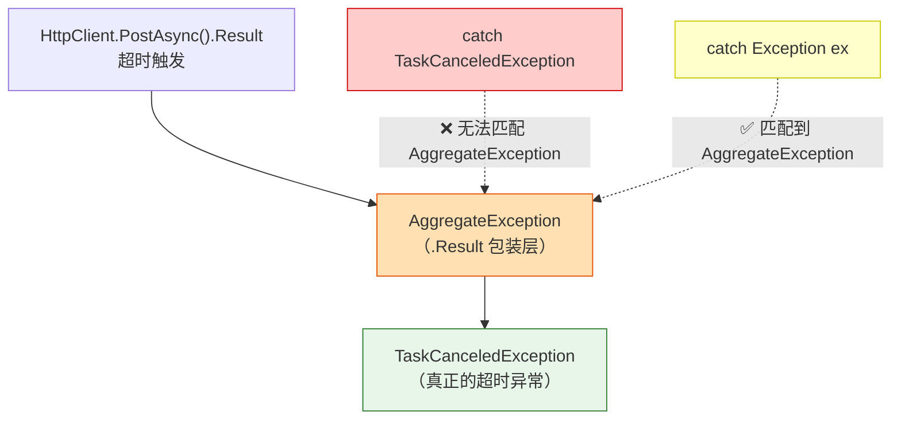
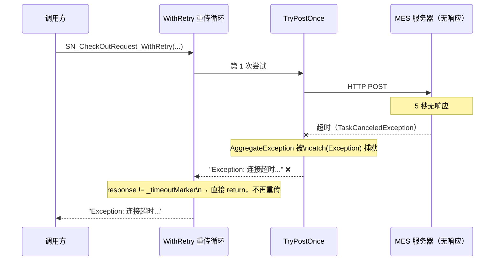
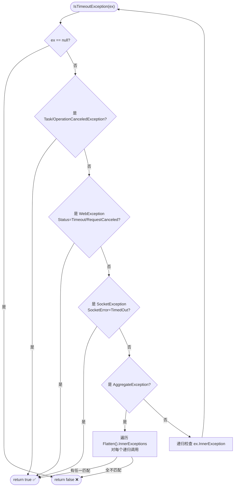
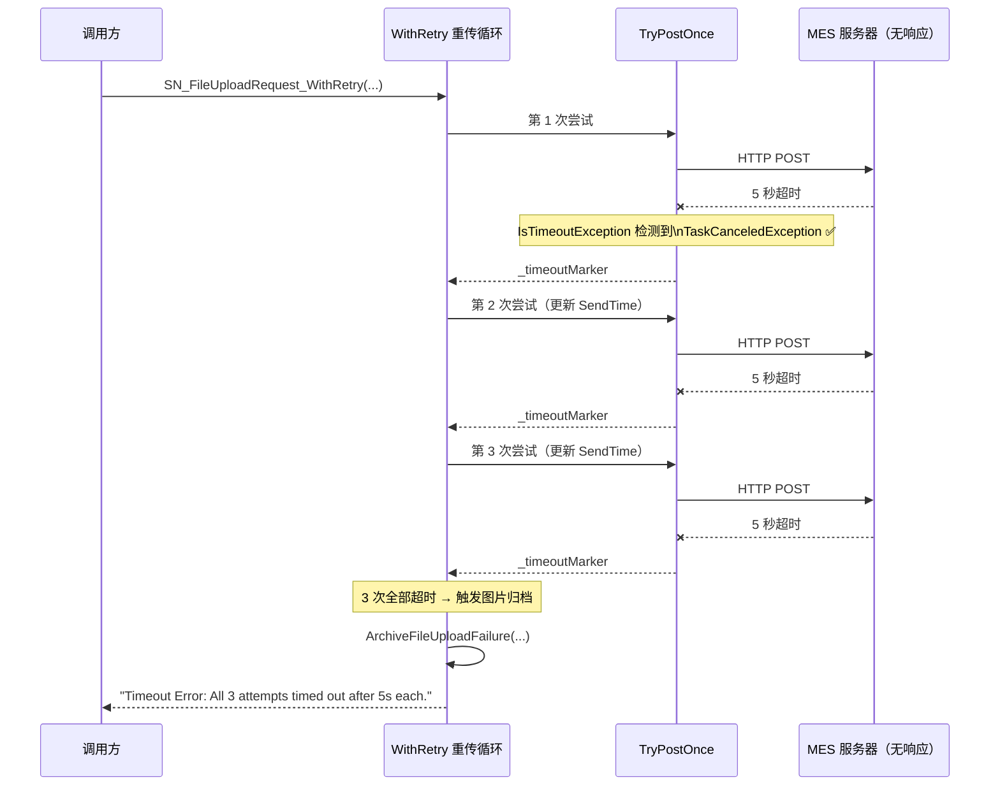
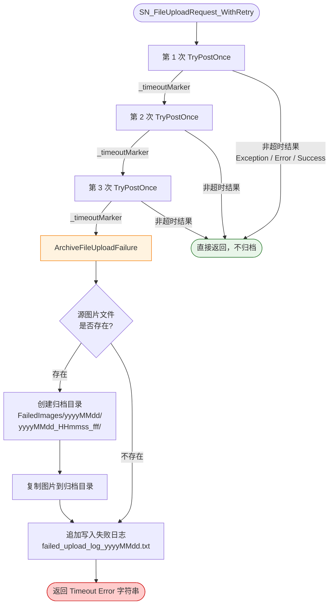

# MES 超时重传 Bug 修复报告

**日期**：2026-04-11  
**涉及文件**：`MyDll/Mes.cs`  
**修复人**：JeeShyang Loh  

---

## 一、问题现象

调用 `SN_FileUploadRequest_WithRetry` / `SN_CheckOutRequest_WithRetry` 时，设计上应在 MES 服务器无响应（5 秒超时）时自动重传最多 3 次，但实际测试发现：

- 每次调用只等待约 5 秒即返回，未发生重传
- 返回结果为 `Exception: ...` 而非预期的 `Timeout Error: All 3 attempts timed out after 5s each.`

---

## 二、根因分析

### 2.1 原始代码逻辑

```csharp
// TryPostOnce（原始版本）
private static string TryPostOnce(string apiUrl, string json) {
    try {
        using (var httpClient = new HttpClient()) {
            httpClient.Timeout = _requestTimeout;  // 5 秒
            ...
            HttpResponseMessage response = httpClient.PostAsync(apiUrl, content).Result; // ← 关键
            ...
        }
    }
    catch (TaskCanceledException) {   // ← 永远捕获不到！
        return _timeoutMarker;
    }
    catch (Exception ex) {            // ← 实际走这里
        return $"Exception: {ex.Message}";
    }
}
```

### 2.2 异常链示意

`.Result` 在 .NET 中会把异步任务抛出的 `TaskCanceledException` **包装进** `AggregateException`，导致上层 `catch (TaskCanceledException)` 无法直接匹配。



### 2.3 重传逻辑失效流程（修复前）



---

## 三、修复方案

### 3.1 核心思路

增加 `IsTimeoutException()` 方法，**递归遍历整个异常链**，识别以下三类超时异常：

| 异常类型 | 来源 |
|---|---|
| `TaskCanceledException` | HttpClient 超时取消（通过 CancellationToken） |
| `OperationCanceledException` | 同上，基类形式 |
| `WebException (Status=Timeout)` | 网络层 HTTP 超时 |
| `WebException (Status=RequestCanceled)` | 请求被取消（超时场景） |
| `SocketException (SocketError=TimedOut)` | Socket 层超时 |

### 3.2 异常链遍历逻辑



### 3.3 修复后代码

```csharp
// Mes.cs — 新增 IsTimeoutException 辅助方法
private static bool IsTimeoutException(Exception ex) {
    if (ex == null) return false;
    if (ex is TaskCanceledException || ex is OperationCanceledException) return true;
    if (ex is System.Net.WebException we &&
        (we.Status == System.Net.WebExceptionStatus.Timeout ||
         we.Status == System.Net.WebExceptionStatus.RequestCanceled)) return true;
    if (ex is System.Net.Sockets.SocketException se &&
        se.SocketErrorCode == System.Net.Sockets.SocketError.TimedOut) return true;
    if (ex is AggregateException ae) {
        foreach (var inner in ae.Flatten().InnerExceptions)
            if (IsTimeoutException(inner)) return true;
        return false;
    }
    return IsTimeoutException(ex.InnerException);
}

// TryPostOnce（修复后）
private static string TryPostOnce(string apiUrl, string json) {
    try {
        ...
        HttpResponseMessage response = httpClient.PostAsync(apiUrl, content).Result;
        ...
    }
    catch (Exception ex) {
        // 递归检查整个异常链是否为超时
        if (IsTimeoutException(ex))
            return _timeoutMarker;  // ← 超时 → 交由调用方重传

        Exception report = ex is AggregateException ae
            ? (ae.Flatten().InnerException ?? ex)
            : ex;
        return $"Exception: {report.Message}";
    }
}
```

### 3.4 修复后重传流程



---

## 四、失败图片归档流程

`SN_FileUploadRequest_WithRetry` 在 3 次全部超时后，会调用 `FailedImageArchiveService` 归档失败图片并写入日志。



### 归档日志格式示例

```
------------------------------------------------------------
FailedTime: 2026-04-11 00:07:07.102
SN: SN_TEST_UPLOAD_001
SourceImagePath: D:\...\test_image.jpg
ArchivedImagePath: D:\...\FailedImages\20260411\20260411_000707_102\test_image.jpg
RetryCount: 3
ErrorMessage: Timeout Error: All 3 attempts timed out after 5s each.
ApiUrl: http://127.0.0.1:58696/api
```

---

## 五、测试验证结果

测试方法：本地起 TCP 静默服务器（接受连接但永不发送 HTTP 响应），确保每次请求都稳定触发 5 秒超时。

| 测试项 | 预期 | 实际结果 | 耗时 | 状态 |
|---|---|---|---|---|
| SN_CheckOut 超时重传 | 重传 3 次，约 15 秒 | `Timeout Error: All 3 attempts timed out after 5s each.` | 15.1 秒 | ✅ PASS |
| SN_FileUpload 超时重传 + 归档 | 重传 3 次后触发归档 | `Timeout Error: All 3 attempts timed out after 5s each.` | 15.0 秒 | ✅ PASS |
| 归档（源文件存在） | 图片复制 + 日志写入 | 日志创建，图片已归档 | - | ✅ PASS |
| 归档（源文件不存在） | 仅写日志，不崩溃 | 日志创建，无异常 | - | ✅ PASS |

---

## 六、注意事项

1. **超时时间配置**：当前固定为 5 秒（`_requestTimeout = TimeSpan.FromSeconds(5)`），如需调整请修改该字段。
2. **重传次数**：固定为 3 次（`const int maxAttempts = 3`），仅超时触发重传，连接拒绝等非超时错误不重传。
3. **归档目录**：默认在程序目录下的 `FailedImages/`，可在调用前通过 `MesClass.FailedImageRootPath` 修改。
4. **并发安全**：`FailedImageArchiveService` 内部使用 `lock` 保护文件复制和日志追加，多线程并发调用安全。
